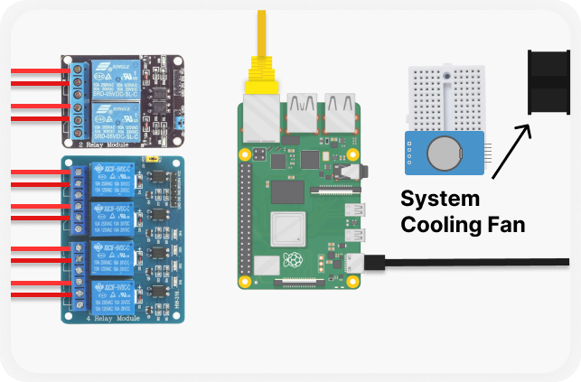

# Maintinance

PHSM should follow maintinance every **1st day of the month** to prevent possible failure on it's **Physical Hardware** & **Software**.

## Physical Maintinance

Before checking the **tubings, mist nozzle, relays, pump, valves** & **other** components, you should enable **debuggin mode** first at the **setting page**.

Debugging mode prevents the system from **toggling** the components **on** while you are checking them.

### Check System Cooling Fan 

PHS process a images, thermal images, manages components every seconds, that's why the processor of system get's **hot**. PHS cooling fan helps the **dissipation** of the device **heat** inorder to maintain it's ideal processing temperature. If the fan fails, the system will struggle to dissipate it's heat and might auto shutdown due to **t-junction** of the CPU. 

Out of the box, PHS is **pre-installed** with **heavy duty 5V high speed industrial fan** which life-span is much longer than any other fan. You can replace this with 5v fan if it fails.

### Check Tubing

Check tubing for **leaks** and fix them to prevent wasting water. You may turn off the entire PHS and it's components while the issue is not yet resolved.

### Checking Relays

Make sure that **Debugging Mode** is enabled in the **settings page**. Go to **relays** tab and try toggling the relay you wanted to test if it's working correctly or not. **Note** that the component that is attatched to that relay will also going **toggle/activate**.

    

If one of the relay module does **not** function correctly, replace the relay with the **same count** of relay module. Make sure to take a photo of the **order** of the wires attatched to the **relay module input controller pins**.

## Software  Maintinance
