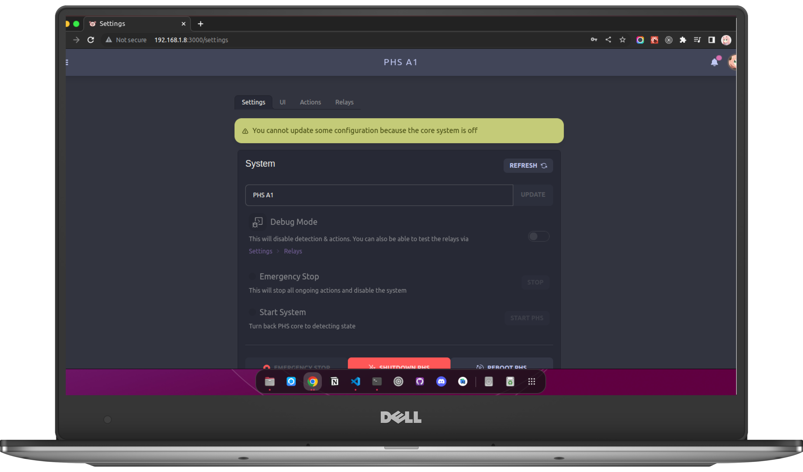
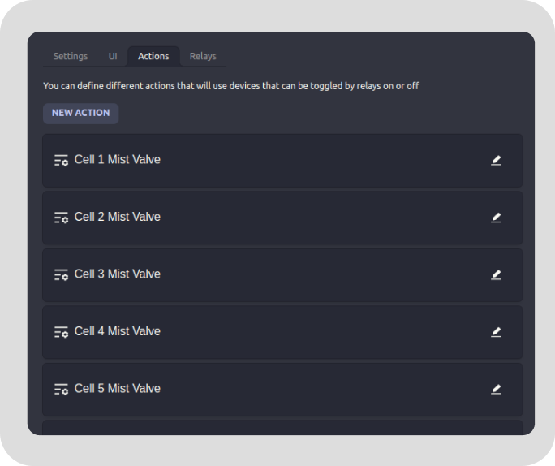

# Settings Page



PHS provides configurations for the system. You can configure settings, system state, detection mode, actions, and relay testing.

## Settings

### System State Control


Let's you control the system state. When the system is on **Debuging mode** or has been **stop**, you can put it back to it's normal state by clicking **Start PHS**. You can also **Shutdown or Reboot** the system. If the state is not showing correctly, you can click **refresh** to get the latest system state.

### Heat Stress Detection Setting


You can choose between **automatic detection** and **manual detection**. 
- **automatic detection** : will use custom trained CNN to identify **heat stress**.
- **manual detection** : will require you to put a preferred temperature threshold to identify **heat stress**

### PHS Pov event cell division


PHS machine uses camera to see the piggery. PHS divide what it see's to a **grid of cells**. Each cells can be **bind** to certain **actions** and **events(pig event, heat stress event, dark scene event)** and if a certain event happens on the particular cell, **all** actions bind on that cell will be **activated**. You can change the grid size by changing **column** and **row** values. Maximum column can be up to **12** while rows can be up to **5** only. 

> **NOTE** : The number of column & rows will base on how many actions / relay you will be having for the system.

### Yolo Weights & CNN Weights

This provide what available Weights can be used for PHS. These weights contains the **trained AI** and the data it **learned** from training, and if there are more options you can select what weights to use. You can add weights by asking the developers if there's new weights. 

### Adding Weights to the system.

You can add new weights to the system by editing ```phsV1Defaults.json``` located at ```CAPSTONE-PHS-Machine/phsmachine_web/defaults/``` and add it on ```"DEFAULT_CONFIGS"``` array 

This is the format to add the new weights. choose depending on what the weight is for. 

**format for YOLO** usually file of weight for YOLO ends with **.pt**
```json
{
    "category": "models",
    "config_name": "NAME OF WEIGHT",
    "description": "DESCRIPTION OF WEIGHT",
    "value": {
        "name": "NAME OF WEIGHT",
        "path": "models/weights/yolo/FILENAME OF WEIGHT",
        "for": "yolo"
    },
    "deletable": false
}
```

**format for HeatStress** usually file of weight for HeatStress ends with **.h5**
```json
{
    "category": "models",
    "config_name": "NAME OF WEIGHT",
    "description": "DISCRIPTION OF WEIGHT",
    "value": {
        "name": "NAME OF WEIGHT",
        "path": "models/weights/maiCNNet/FILENAME OF WEIGHT",
        "for": "heatstress"
    },
    "deletable": false
}
```

Then Depending on what the weights is for, you need to move it either ```maiCNNet``` or ```yolo``` which is located at ```CAPSTONE-PHS-Machine/Pig-Stress-DP-Algorithm/models/weights/```

> **NOTE** : after adding weights. You must reset the system, uncheck all checkbox except settings, this will update the default settings with the new one you edited. Then the system will reboot.

> **NOTE** : We do not recommend doing this by yourself, please ask some assitance from a technical person or contact the developer.

### Automatic Record Deletion & Hard Reset 


**PHS Automatic Record Deletion** indicates that once **PHS** exceeds **95%** of total storage, instead of stop detecting, the system will **delete old records** automatically to accomodate new ones. 

**PHS Hard Reset** You can tell PHS what to reset by checking / unchecking the checkbox.

> **NOTE** : Please read the description on the checkboxes before confirming reset. Reset can wipe your detection datas and other exports.

> **TIP** : When exporting or zipping data, PHS will create a copy of these datas and create a downloadable links for them. These copies is not deleted so that the links will be available if the downloads failed or the system restarts unexpectedly. You can delete these cache using reset to freeup space.

## UI


- **Theme** : Changes the web theme color. This will only apply to current device
- **Monitor** : Changes the Monitor layout on the Monitor page.

## Actions



These page contains all list of actions defined to be used by the system. Each actions uses **relay** and **events**. You can configure them.

> **NOTE** : Some actions are default & cannot be deleted

### Creating Actions


These are the required field to be filled in order to create an action.

- **Action Name** - Unique Name of action
- **Description** - Description of the action to easily identify the action
- **Target Relays** - What relays will be activated when this action is activated
- **Event/AI/Caller** - what event will activate this action.

These are the possible events
- **Heat Stress Detector** - When a pig is heat stressed, then this event will activate
- **Pig Detector** - When a pig is detected, this event will activate
- **Dark Scene Detector** - When the camera see's darker scene, this will activate


If required to select a cell, you should select **single cell only**. This cell will be the source of activation of the event.


If you don't want to specify which cell this event will activate, you can enable **force activate** to set the action to force active. When force activate is enabled, **regardless** of cell location, if one of all cell fire the matching event you selected, then this action will also **activate**.

## Relays


These relays are the switches that controls any components that can be turned on and off by the system. Usually these components is **solenoid valve, pump, lights, etc..**. If the system is in **debugging mode** you can toggle these relays manualy to test it's functionality.

> **REMINDER** : Some of these relays handle high voltage components. Please be careful when testing